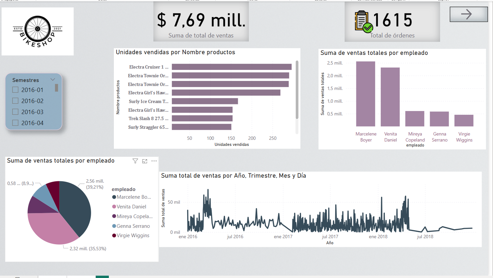
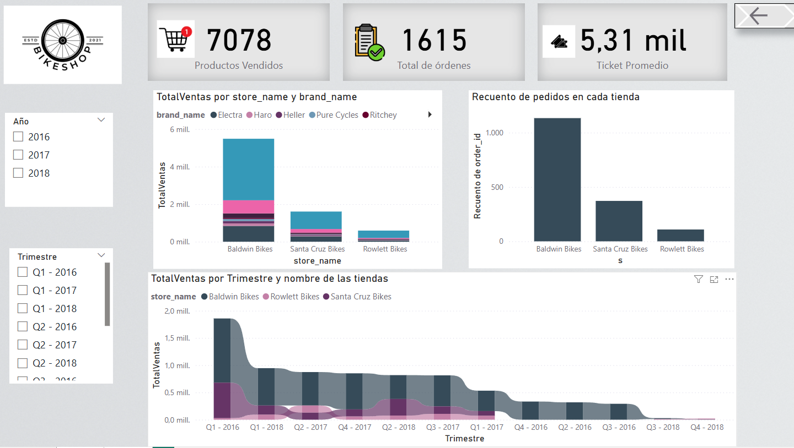

# Informe en  power bi

## Explicación 

## Este reporte desarrollado en Power BI presenta un análisis completo de ventas, pedidos, productos y desempeño por tienda y empleado en una tienda de bicicletas, utilizando múltiples visualizaciones e interacciones.

