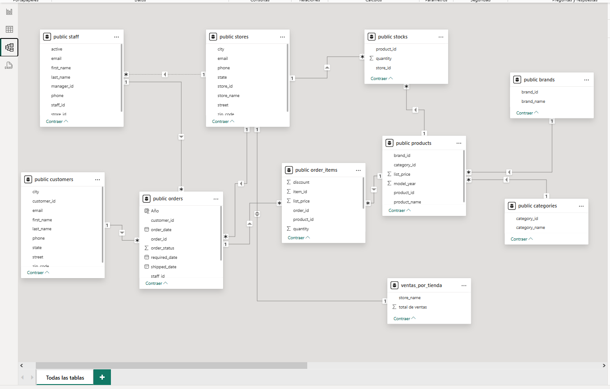

# Informe en  power bi

##  Aquí te mostraré la base de datos relacional que se trabajó desde PgAdmin 4. 

## Este reporte desarrollado en Power BI presenta un análisis completo de ventas, pedidos, productos y desempeño por tienda y empleado en una tienda de bicicletas, utilizando múltiples visualizaciones e interacciones.

